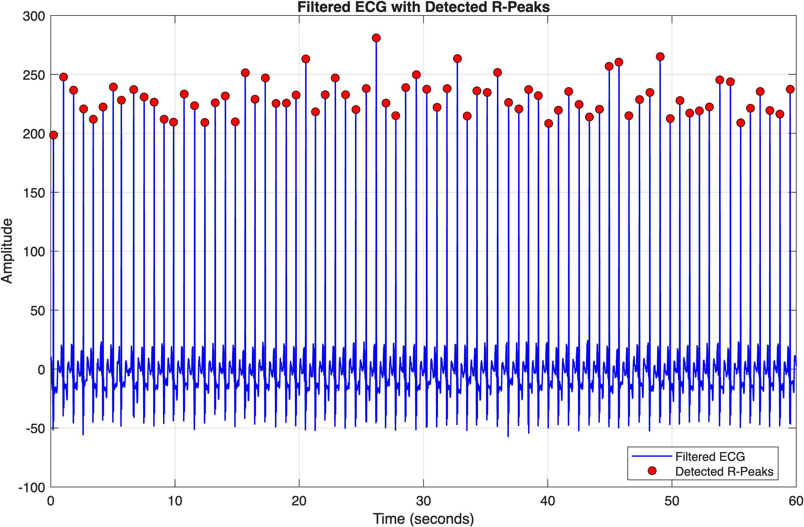

# ECG Signal Processing and Heart Rate Variability Analysis Using MATLAB

A MATLAB-based biomedical signal processing project for analyzing real electrocardiogram (ECG) recordings from the MIT-BIH Arrhythmia Database. The project implements an ECG analysis pipeline including signal preprocessing, R-peak detection, heart rate estimation, RR interval analysis, and basic heart rate variability (HRV) assessment.


## Overview

Electrocardiography (ECG) is widely used to monitor the electrical activity of the heart. Recorded ECG signals can contain baseline wander, high-frequency noise, and other signal artifacts that can interfere with analysis.

This project implements a MATLAB-based pipeline for processing an ECG recording and extracting quantitative cardiac measurements.

The overall workflow is:

Raw ECG → Signal Filtering → R-Peak Detection → RR Intervals → Heart Rate → HRV Analysis


## Objectives

The main objectives of this project are to:

- Import and analyze a real ECG recording
- Visualize raw ECG signals
- Remove baseline wander and high-frequency noise
- Detect R-peaks corresponding to cardiac cycles
- Calculate RR intervals
- Estimate instantaneous heart rate
- Calculate basic heart rate statistics
- Quantify short-term heart rate variability
- Visualize ECG and cardiac timing characteristics
- Develop a modular MATLAB signal processing workflow
- Interpret physiological signals using quantitative analysis


## Dataset

This project uses record 100 from the MIT-BIH Arrhythmia Database available through PhysioNet.

The recording used in this analysis has:

- Sampling frequency: 360 Hz
- Analysis duration: 60 seconds
- Samples analyzed: 21,600
- ECG channel: MLII

The first 60 seconds of the recording are analyzed.


## Project Pipeline

### 1. ECG Data Import

The ECG recording is loaded into MATLAB and converted to double precision for numerical processing.

The first 60 seconds of the selected ECG channel are extracted for analysis.


### 2. ECG Signal Preprocessing

Raw ECG recordings can contain low-frequency baseline wander and high-frequency noise.

A two-stage filtering approach is used:

1. High-pass filtering at 0.5 Hz
2. Low-pass filtering at 40 Hz

This creates an effective passband of approximately 0.5–40 Hz.

The high-pass filter reduces baseline wander, while the low-pass filter reduces high-frequency noise. Zero-phase filtering is performed using MATLAB's filtfilt function to minimize phase distortion.


### 3. R-Peak Detection

After preprocessing, R-peaks are detected using MATLAB's findpeaks function.

The detector uses:

- A minimum peak amplitude threshold
- A minimum separation between detected peaks

The detected R-peaks are plotted on the filtered ECG waveform for visual verification.


### 4. RR Interval and Heart Rate Analysis

RR intervals are calculated from consecutive R-peak locations.

Instantaneous heart rate is calculated from the RR intervals and reported in beats per minute (BPM).

The following measurements are calculated:

- Average heart rate
- Maximum heart rate
- Minimum heart rate
- Heart rate over time


### 5. Heart Rate Variability

Basic time-domain HRV analysis is performed using the detected RR intervals.

The following metrics are calculated:

- Mean RR interval
- SDNN

RR intervals are also visualized over time and as a distribution.


## Results

The project generates six figures describing the ECG signal and cardiac timing characteristics.

### Figure 1 — Raw vs. Filtered ECG

Comparison of the original ECG signal and the filtered ECG signal.

File: `results/filtered_ecg.png`
[ecg](results/filtered_ecg.png)

### Figure 2 — Detected R-Peaks

Filtered ECG signal with detected R-peaks marked on the waveform.



### Figure 3 — Heart Rate Over Time

Instantaneous heart rate calculated from consecutive RR intervals.

File: `results/heart_rate.png`


### Figure 4 — RR Intervals Over Time

Beat-to-beat variation in RR intervals.

File: `results/hrv_plot.png`


### Figure 5 — RR Interval Distribution

Histogram showing the distribution of detected RR intervals.

File: `results/rr_histogram.png`


### Figure 6 — HRV Boxplot

Boxplot showing the distribution of RR intervals.

File: `results/hrv_boxplot.png`


## Example Results

The MATLAB program automatically generates a numerical summary.

Example:

```text
=========================================
           ECG ANALYSIS SUMMARY
=========================================

Recording Length : 60 seconds
Heartbeats       : 74
Average HR       : 74.0 BPM
Maximum HR       : 91.9 BPM
Minimum HR       : 60.2 BPM
Mean RR Interval : 0.812 seconds
SDNN             : 0.038 seconds

=========================================
```

## Project Structure

```text
ECG-Signal-Processing-MATLAB/
│
├── data/
│   └── 100m.mat
│
├── results/
│   ├── filtered_ecg.png
│   ├── detected_peaks.png
│   ├── heart_rate.png
│   ├── hrv_plot.png
│   ├── rr_histogram.png
│   └── hrv_boxplot.png
│
├── src/
│   ├── main.m
│   ├── preprocess_signal.m
│   ├── detect_qrs.m
│   ├── calculate_heart_rate.m
│   └── calculate_hrv.m
│
├── report/
│   └── ECG_Analysis_Report.pdf
│
└── README.md
```


## MATLAB Files

### main.m

Controls the complete ECG analysis pipeline.

The script:

1. Loads the ECG data
2. Creates the time vector
3. Calls the preprocessing function
4. Detects R-peaks
5. Calculates RR intervals and heart rate
6. Calculates HRV metrics
7. Generates figures
8. Exports figures to the results directory
9. Prints a numerical analysis summary


### preprocess_signal.m

Performs ECG signal preprocessing.

Inputs:

- ecg — raw ECG signal
- Fs — sampling frequency

Output:

- filteredECG — filtered ECG signal

The function applies:

- 0.5 Hz high-pass filtering
- 40 Hz low-pass filtering
- Zero-phase filtering using filtfilt


### detect_qrs.m

Detects R-peaks from the filtered ECG signal.

Inputs:

- filteredECG
- Fs

Outputs:

- peakValues
- peakLocations

The detected peak locations are used to calculate RR intervals.


### calculate_heart_rate.m

Calculates:

- RR intervals
- Instantaneous heart rate
- Time associated with each heart rate measurement


### calculate_hrv.m

Calculates basic time-domain HRV metrics:

- Mean RR interval
- SDNN


## Limitations

- The R-peak detector uses amplitude thresholding and minimum peak separation and may not perform reliably on all ECG recordings.
- Only 60 seconds of ECG data are analyzed.
- R-peak detection is currently evaluated through visual inspection rather than comparison with reference annotations.
- SDNN is used as a basic descriptive HRV measure and should not be interpreted as a clinical assessment.
- The current filtering approach is designed primarily for QRS and R-peak analysis and may not be appropriate for all ECG applications.


## Future Improvements

Potential extensions include:

- Implementing a Pan-Tompkins QRS detection algorithm
- Comparing detected R-peaks with reference annotations
- Calculating sensitivity and positive predictive value
- Testing the pipeline on additional MIT-BIH recordings
- Investigating FIR and IIR filter performance
- Adding FFT-based frequency analysis
- Implementing additional HRV metrics such as RMSSD and pNN50
- Adding frequency-domain HRV analysis
- Evaluating the algorithm under different noise conditions


## Skills Demonstrated

- Biomedical signal processing
- ECG analysis
- MATLAB programming
- Digital filtering
- IIR filter design
- Zero-phase filtering
- QRS/R-peak detection
- Time-series analysis
- Physiological data analysis
- Heart rate estimation
- Heart rate variability
- Data visualization
- Modular programming
- Scientific interpretation
- Research documentation


## Reproducibility

To reproduce the analysis:

1. Install MATLAB with the required Signal Processing Toolbox functionality.
2. Obtain the MIT-BIH Arrhythmia Database record used in this project.
3. Place the ECG data file in the data directory.
4. Place the MATLAB scripts in the src directory.
5. Ensure the results directory exists.
6. Open MATLAB and navigate to the project directory.
7. Run main.m.

The processed ECG results and figures will be generated automatically.


## Scientific Context

ECG signal processing is an important component of biomedical engineering applications including:

- Patient monitoring
- Wearable health technologies
- Cardiovascular diagnostics
- Biosensors
- Medical instrumentation
- Digital health
- Physiological monitoring
- Automated cardiac event detection

This project demonstrates a simplified research-oriented workflow for converting raw physiological data into quantitative cardiac measurements.


## References

1. Moody, G. B., & Mark, R. G. (2001). The impact of the MIT-BIH Arrhythmia Database. IEEE Engineering in Medicine and Biology Magazine, 20(3), 45–50.

2. Goldberger, A. L., et al. (2000). PhysioBank, PhysioToolkit, and PhysioNet: Components of a new research resource for complex physiologic signals. Circulation, 101(23), e215–e220.

3. Pan, J., & Tompkins, W. J. (1985). A real-time QRS detection algorithm. IEEE Transactions on Biomedical Engineering, BME-32(3), 230–236.

4. Task Force of the European Society of Cardiology and the North American Society of Pacing and Electrophysiology. (1996). Heart rate variability: Standards of measurement, physiological interpretation and clinical use. Circulation, 93(5), 1043–1065.


## Author

Veera Pranavi Budhi

Biomedical Engineering Project
ECG Signal Processing and Heart Rate Variability Analysis Using MATLAB


## Disclaimer

This project is intended for educational and research purposes only. The results generated by this software should not be used for medical diagnosis, clinical decision-making, or assessment of an individual's cardiovascular health.
